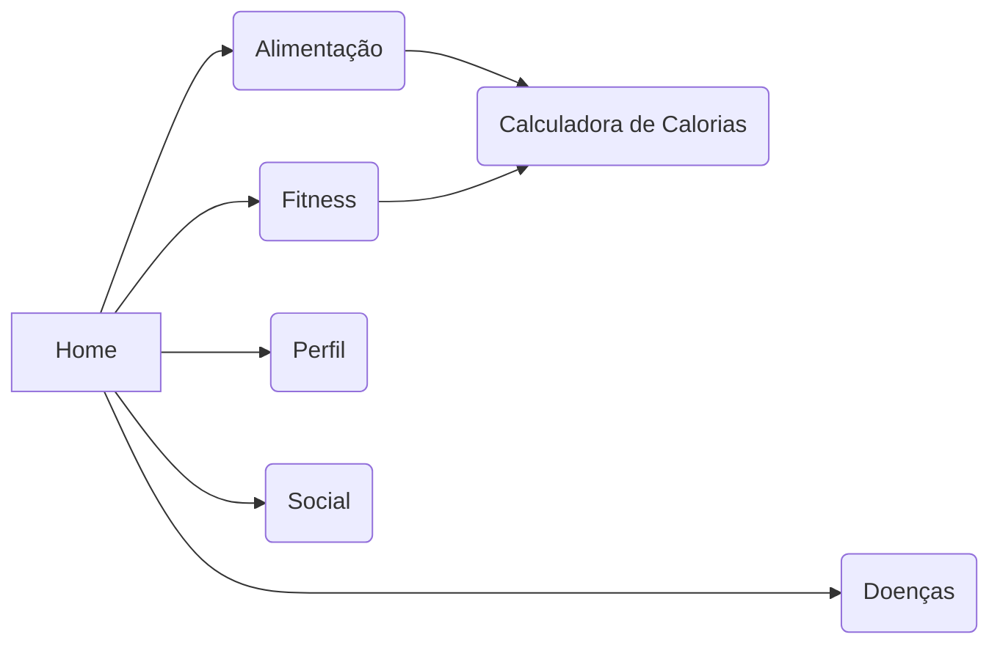

# Trabalho de Conclusão de Curso
Home,
    Doenças,
    Fitness,
    Alimentação,
        Calculadora de cal,
    Perfil,
    Social,

## Anotações DANIEL
    > Quando colocar o mouse nos sucos da home mostrar a receita , ou ao clicar
    > Ceos ta ESTICADAÇO
    > Print do social e rodapé
    > CSS do doenças e rodapé , retirar fitness
## JP 
    > Mais exerciocio e mais comida na calculadora
    
> $ git config --global user.email "godlolpro32@gmail.com"
> $ git config --global user.name "JP1005YT"

>https://jwt.io/

https://prod.liveshare.vsengsaas.visualstudio.com/join?1C5C1A926E391D04C8A3AA3B5A7F2A13E24B
