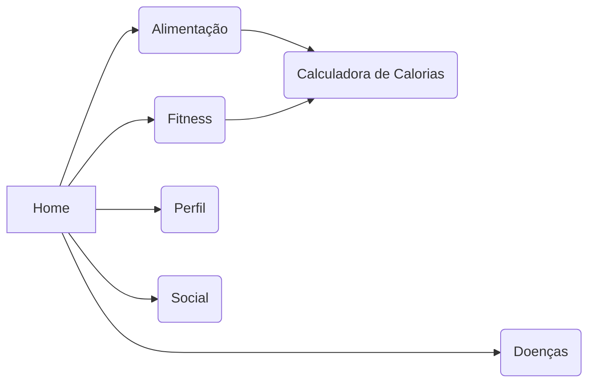

# Trabalho de Conclusão de Curso
Home,
    Doenças,
    Fitness,
    Alimentação,
        Calculadora de cal,
    Perfil,
    Social,

## Anotações JP
    > Checagem de Usuario (Existente)
    > Checar se chat ja existem
    > Barra de pesquisar do social
    > Confirmação ao Sair
    > Arrumar os exercicios fisicos
    > Footer do Fitness
    > Calculadora e Pagina dos Exercicios
    > Ao entrar em outra pagina e tentar fazer login retornar para esta e nao para a home
    > trocar exercicios para : alterações.txt
    > colocar no input "Digite o conteudo do post"
### Anotações Manu
    > A barra de pesquisar do social não funciona.
    
> $ git config --global user.email "godlolpro32@gmail.com"
> $ git config --global user.name "JP1005YT"

>https://jwt.io/

https://prod.liveshare.vsengsaas.visualstudio.com/join?540383E30535FB716F5E5C1EEBBDAA0192C3
