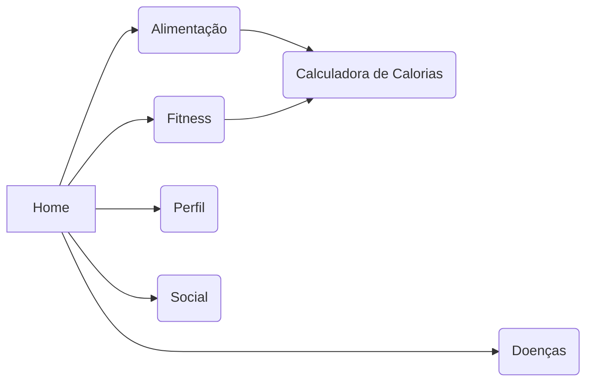

# Trabalho de Conclusão de Curso
Home,
    Doenças,
    Fitness,
    Alimentação,
        Calculadora de cal,
    Perfil,
    Social,

## Anotações JP
    > Ao criar chat , redirecionar para o mesmo
    > Ao criar nova tag retirar arrumar o recarregamento do rank que esta duplicando
    > Ao criar novo post fechar a pagina e zerar os inputs
    > Foto_de_Perfil
    > Checagem de Usuario (Existente)
    > Enter para formularios

### Anotações Manu
    > Alterar o login e por um link que leva para o cadastrar, alterar o branco pintado do cadastrar para quando o login estiver selecionado o login ficar branco e quando o cadastrar estiver selecionado ficar o cadastrar branco.
    > Por o link quando clica para criar um chat.
    > Arrumar o envio do post, não envia no botão e depois não volta para a pagina principal.
    > Fazer a logo.
    > A barra de pesquisar do social não funciona.
    
> $ git config --global user.email "godlolpro32@gmail.com"
> $ git config --global user.name "JP1005YT"

>https://jwt.io/
>https://caloriasporalimentoapi.herokuapp.com/
