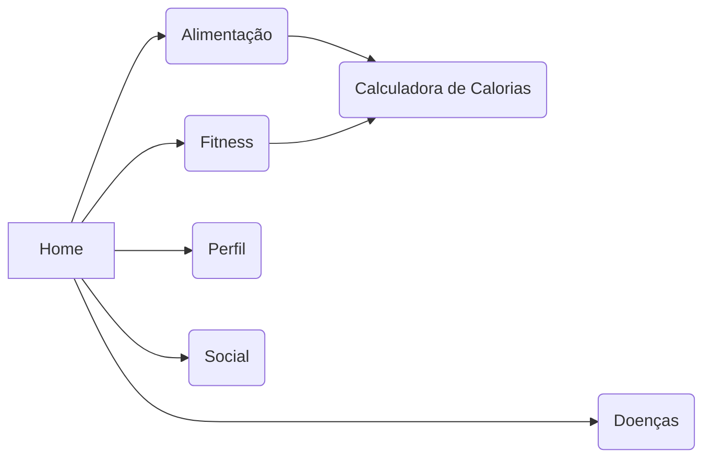

# Trabalho de Conclusão de Curso
Home,
    Doenças,
    Fitness,
    Alimentação,
        Calculadora de cal,
    Perfil,
    Social,

## Anotações JP
    > Ao criar nova tag retirar arrumar o recarregamento do rank que esta duplicando
    > Ao criar novo post fechar a pagina e zerar os inputs
    > Checagem de Usuario (Existente)
    > Checar se chat ja existem
### Anotações Manu
    > Fazer a logo.
    > A barra de pesquisar do social não funciona.
    
> $ git config --global user.email "godlolpro32@gmail.com"
> $ git config --global user.name "JP1005YT"

>https://jwt.io/