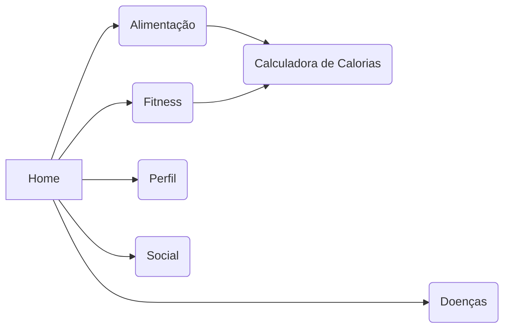

# Trabalho de Conclusão de Curso
Home,
    Doenças,
    Fitness,
    Alimentação,
        Calculadora de cal,
    Perfil,
    Social,

## Anotações JP
    > **IMPORTANTE** Adicionar Peso,Altura no banco
    > Foto_de_Perfil
    > Checagem de Usuario (Existente)
    > Enter para formularios
    
> $ git config --global user.email "godlolpro32@gmail.com"
> $ git config --global user.name "JP1005YT"

>https://jwt.io/